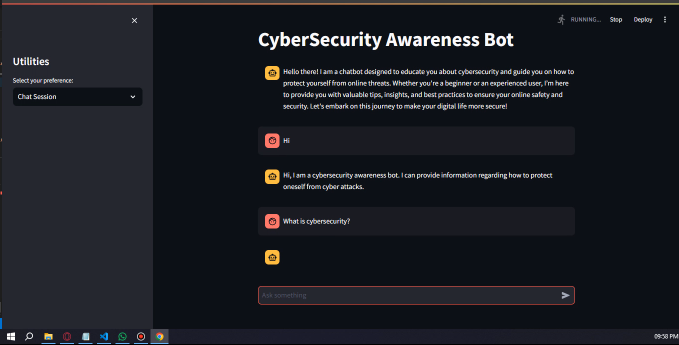
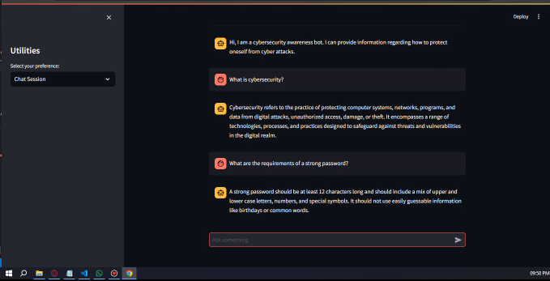
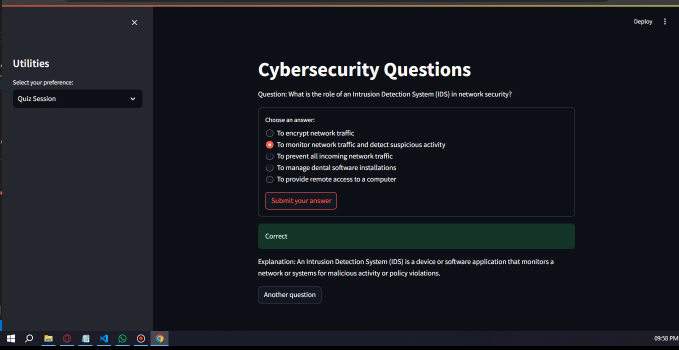
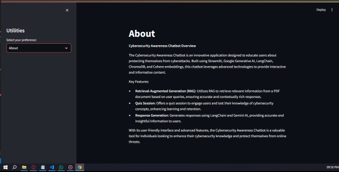

# CyberSecurity Awareness Bot

This chatbot app is created using Streamlit to provide knowledge on how individuals can protect themselves from cyber threats. It leverages the Retrieval-Augmented Generation (RAG) concept to answer cybersecurity-related questions. Here's an overview of how the bot works and its technical components:

## Overview

### Core Functionality
The bot uses a pre-loaded PDF document containing relevant questions and answers on cybersecurity. This document is processed to create vector embeddings using Cohere Embeddings. These embeddings are stored locally in a vector database managed by ChromaDB, both of which are part of the LangChain community. The LangChain community also facilitates document loading, text splitting, and vector storage.

### Retrieval-Augmented Generation (RAG)
When a user asks a question, the bot searches for similar contexts within the vector database using similarity search. This ensures that the response is relevant and accurate.

### Response Generation
Based on the retrieved contexts, the bot generates responses using Google Gemini AI.

### Quiz Feature
In addition to answering questions, the app includes a quiz section. The quizzes are generated using an AI model and supplemented with questions from a local JSON file. This interactive feature helps users test their cybersecurity knowledge.

## Usage
To run the application, ensure the paths to the PDF documents and other are correctly specified and the necessary API keys are in place. The sample output is available in the `sample_output_video` folder, with additional images provided below.

By following the outlined process, this chatbot effectively combines AI and cybersecurity knowledge to create an engaging and educational user experience.

